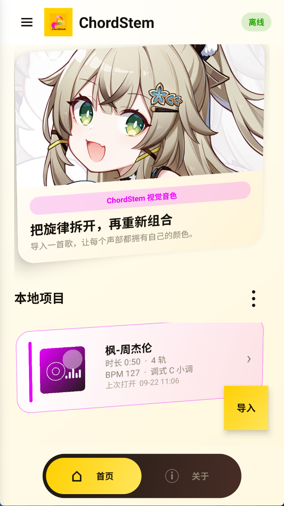
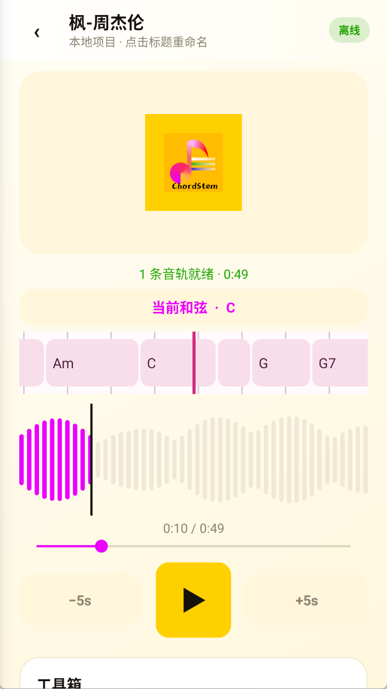
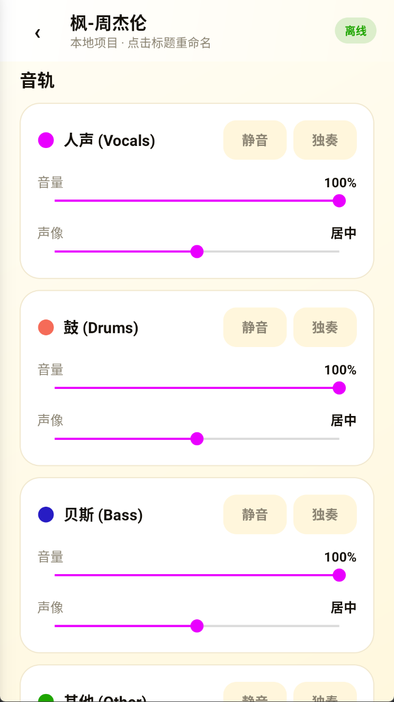

# ChordStem

[](https://github.com/lmhstart/Chordstem)
[](https://developer.android.com/)
[](#隐私与离线运行)
[](https://github.com/lmhstart/Chordstem)

> 在本机完成分轨、和弦分析、BPM 识别与混音。<br>
> 不将音频上传至云端，不依赖账号。

ChordStem 是一款 Android 离线音频工作台，支持 AI 分轨、和弦分析、BPM 识别、音频处理和自定义导出。

它面向音乐练习者、编曲学习者，以及希望快速理解和处理音乐的独立音乐人。

ChordStem 不试图成为一个复杂的在线音乐平台，而是专注于一件事：

**让一首歌从导入到分析、练习和导出，都留在你的设备里完成。**

## 界面预览

<table>
  <tr>
    <td align="center"><strong>首页</strong></td>
    <td align="center"><strong>本地项目</strong></td>
  </tr>
  <tr>
    <td></td>
    <td></td>
  </tr>
  <tr>
    <td align="center"><strong>音频工作台</strong></td>
    <td align="center"><strong>音轨控制</strong></td>
  </tr>
  <tr>
    <td></td>
    <td></td>
  </tr>
</table>

## 为什么做 ChordStem

我开始做 ChordStem，是因为很多刚接触钢琴或吉他的音乐爱好者，都有过这样的经历：想快速演奏自己喜欢的歌曲，却不一定能在网上找到合适的谱子，也还没有足够的听音和扒谱能力。

ChordStem 希望降低这道门槛。即使是刚开始学习音乐的用户，也可以通过和弦分析快速理解歌曲，通过分轨获得更清晰的伴奏，并将处理后的音频导出，用于练习和创作。

很多音乐工具越来越依赖账号、云端处理和订阅服务。

ChordStem 选择了一条更安静、更专注的路线：

- 音频留在本机处理
- 分析过程尽量透明
- 功能围绕练习和创作，而不是信息流
- 界面有触感，但不牺牲效率
- 不用复杂的工作流阻挡你听见结果

它不是为了替代专业 DAW。

它更像是一个放在手机里的音乐草稿桌：打开一首歌，拆开它，听懂它，然后继续练习。

## 核心能力

- AI 音频分轨
- 人声、鼓、贝斯和其他音轨管理
- 和弦分析与时间线展示
- BPM 识别
- 调式分析
- 音轨独奏、静音与音量控制
- A-B 循环练习
- 自定义音频导出
- 本地项目记录与音频摘要
- 手机姿态驱动的卡片交互效果

## 使用流程

1. 从首页导入一首本地音频
2. 等待本机完成分轨、BPM 和和弦分析
3. 在音频工作台中试听不同音轨
4. 使用独奏、静音、音量控制和 A-B 循环进行练习
5. 根据需要导出处理后的音频

## 隐私与离线运行

ChordStem 的设计原则是本地优先：

- 不要求注册账号
- 不将用户音频上传至云端
- 不依赖云端音频分析服务
- 音频处理和项目记录保存在本机
- 核心功能不依赖网络连接

请仅处理你拥有合法使用权的音频文件，并遵守相关版权规定。

## 技术栈

- Android
- Java
- ONNX Runtime
- Android MediaCodec
- 本地音频分析引擎
- 自定义 View 与原生 Android UI

## 当前版本

- 版本：6.1.0
- 构建号：61
- 最低支持：Android 7.0+
- 平台：Android
- 状态：持续开发中

## 构建项目

```bash
git clone https://github.com/lmhstart/Chordstem.git
cd Chordstem
./gradlew assembleDebug
```

Windows 用户可以使用：

```powershell
.\gradlew.bat assembleDebug
```

生成的 APK 位于：

```text
app/build/outputs/apk/debug/app-debug.apk
```

## 当前限制

ChordStem 仍在持续完善中，以下情况可能影响分析结果：

- 不同音乐风格的分轨效果会有差异
- 复杂和弦、现场录音和强混响环境可能降低识别准确度
- 本地分析速度取决于设备性能
- 部分功能仍处于实验阶段

ChordStem 更适合练习、扒谱、快速分析和个人创作辅助，不应被视为专业录音棚替代品。

## 开源与反馈

如果你发现了问题，欢迎提交 Issue。

如果你有关于交互、音乐分析或 Android 性能优化的建议，也欢迎参与讨论。

- [查看源代码](https://github.com/lmhstart/Chordstem)
- [提交 Issue](https://github.com/lmhstart/Chordstem/issues)

## 开发计划

- [ ] 更稳定的分轨处理流程
- [ ] 更细致的和弦时间线编辑
- [ ] 更好的分析进度反馈
- [ ] 更多音频格式支持
- [ ] 更完善的本地项目管理
- [ ] 性能与低端设备适配优化

## 作者

Made for music makers.

由 lmhstart 独立开发。
